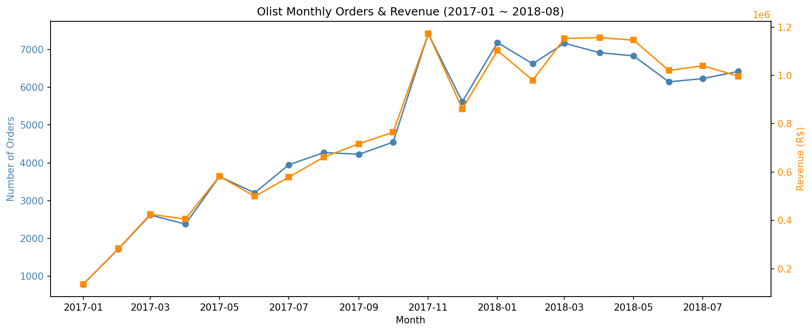
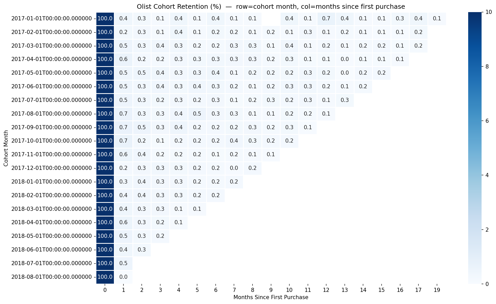

# 🛒 Olist 이커머스 SQL 분석 — 리텐션·코호트·배송 영향

> 브라질 이커머스 Olist의 거래 데이터(약 10만 건 주문)를 **SQL만으로** 분석해,
> **"왜 고객이 돌아오지 않는가"** 를 단계적으로 진단하고 개선 우선순위를 제안한 프로젝트입니다.

---

## 📌 한눈에 보기

| 항목 | 내용 |
|---|---|
| **데이터** | [Brazilian E-Commerce Public Dataset by Olist](https://www.kaggle.com/datasets/olistbr/brazilian-ecommerce) (Kaggle, 약 10만 주문) |
| **사용 기술** | SQL (DuckDB) · CTE · 윈도우 함수 · Python(시각화) · Tableau |
| **분석 테이블** | orders, customers, order_items, payments, reviews, products (6개 JOIN) |
| **핵심 역량** | 다중 테이블 JOIN, 데이터 함정 발견·교정, 코호트 리텐션, 비즈니스 인사이트 도출 |

### 프로젝트 결론 (한 문장)
> **"Olist는 성장하고 있지만 고객을 붙잡지 못하며, 그 이탈은 첫 달에 즉시 일어나고, 배송 경험이 핵심 변수다."**

---

## 🔍 분석 흐름 — 4개의 질문이 하나의 스토리로

```
Q1. 성장하고 있는가?        →  Yes. 우상향 + 블프 스파이크
Q2. 고객이 돌아오는가?      →  No. 재구매 3%뿐, 신규 의존 구조
Q3. 그럼 언제 떠나는가?     →  첫 달에 즉시 이탈 (1개월차 0.4%)
Q4. 왜 떠나는가? (원인 후보) →  배송 지연 시 만족도 급락
```

---

## Q1. 월별 매출·주문 추이 (시계열)

**질문.** Olist는 성장하고 있는가? 매출과 주문은 시간에 따라 어떻게 변했는가?

**접근.** `orders`와 `payments`를 JOIN해 월별 집계. 이 과정에서 한 주문에 결제 행이 여러 개(최대 29개) 붙는 **1:N fan-out** 을 발견 → 주문 수는 `COUNT(DISTINCT order_id)`로 중복 제거, 매출은 `SUM`으로 전액 합산. 데이터 수집 경계의 불완전 구간(2016년 초·2018-09 이후)은 추세 해석에서 제외.

**발견.** 2017-01 ~ 2018-08 주문·매출 모두 뚜렷한 우상향. **2017년 11월 매출 117만 헤알로 첫 100만 돌파 및 스파이크(블랙 프라이데이 추정).** 이후 월 100만 안팎으로 안정화. 주문 수와 매출 증가율이 일부 달에 엇갈려 객단가(AOV) 변동을 시사.

**제안.** 11월 스파이크 구매층의 재구매 여부를 추적해 "프로모션이 신규 고객 정착으로 이어지는가" 검증. 매출을 "주문 수 × 객단가"로 분해해 성장 동인을 구분 관리.

📄 쿼리: `sql/q1_monthly_trend.sql`


---

## Q2. 재구매율 — 데이터 함정 발견·교정

**질문.** 고객은 한 번 사고 마는가, 다시 돌아오는가?

**접근.** 고객별 주문 수를 세던 중, `customer_id`로 집계하면 **최대 주문수가 1, 재구매 고객이 0** 으로 나오는 비상식적 결과를 발견. 데이터를 점검해 `customer_id`가 **주문마다 새로 발급**되는 구조임을 확인하고, 실제 개인을 식별하는 `customer_unique_id`로 교정(`customers` JOIN). 교정 후 최대 주문수 16으로 정상화.

**발견.** 전체 고객의 **96.96%가 단 1회만 구매**, 재구매 고객은 **3.04%**. 평균 구매 횟수 1.03회. 사실상 신규 1회성 구매가 비즈니스의 대부분.

**제안.** 신규 획득 의존도가 매우 높아 **리텐션이 최우선 개선 레버**. 단, 멀티셀러 마켓플레이스 특성상 본질적 재구매율 한계를 고려해 목표치를 현실적으로 설정.

> 💡 **이 분석의 핵심은 결과(3%)가 아니라 과정입니다.** "비상식적 결과 → 의심 → 원인 규명 → 교정"이라는 데이터 검증 서사가 데이터 리터러시를 증명합니다. 많은 초보 분석이 `customer_id`로 잘못 집계하는 지점입니다.

📄 쿼리: [`sql/q2_repurchase_rate.sql`](sql/q2_repurchase_rate.sql)

| 고객 유형 | 인원 | 비율 |
|---|---|---|
| 1회 구매 (신규) | 92,102 | 96.96% |
| 2회 이상 (재구매) | 2,888 | 3.04% |

---

## Q3. 코호트 리텐션 (윈도우 함수)

**질문.** 고객은 첫 구매 이후 언제, 얼마나 이탈하는가? 가입 시기별 차이는?

**접근.** CTE 3개로 단계 분리 — ① 고객별 첫 구매 월(`MIN`)로 코호트 정의, ② 활동 월(`DISTINCT`) 집계, ③ JOIN 후 `date_diff`로 경과 개월 계산. `FIRST_VALUE() OVER (PARTITION BY cohort_month)` 윈도우 함수로 각 코호트의 0개월차 인원을 분모 삼아 잔존율 산출. 표본 1~2명인 2016년 코호트는 비율 불안정으로 제외. 결과를 피벗해 히트맵 시각화.

**발견.** 표본이 충분한 2017-01 코호트(752명) 기준 **0개월차 100% → 1개월차 0.4%로 급락.** Q2의 집계 재구매율(3%)이 사실은 "완만한 감소"가 아니라 **"1개월차 즉시 이탈"** 의 결과임을 규명. 모든 코호트에서 동일 패턴 반복 → 구조적 특성.

**제안.** 이탈이 첫 달에 집중되므로 **리텐션 개입의 골든타임은 첫 구매 직후 30일.** 이 구간에 재구매 트리거(만족도 확인·연관 추천·기간 한정 인센티브)를 집중 배치.

📄 쿼리: `sql/q3_cohort_retention.sql`


---

## Q4. 배송 지연 → 리뷰 평점 영향 (인사이트 & 액션)

**질문.** 배송이 약속보다 늦으면 만족도가 떨어지는가? 얼마나, 그리고 얼마나 빈번한가?

**접근.** 배송 만족도를 '절대 소요일'이 아닌 **'약속 대비 준수 여부'** 로 정의. `date_diff`로 예상 배송일과 실제 배송일 차이를 계산하고 `CASE`로 3구간 분류. 평균이 숨기는 양극화를 잡기 위해 `SUM(CASE...)`로 저평점(1~2점) 비율을 별도 산출. 배송 완료 주문만 대상, 날짜 결측 제외.

**발견.** 배송 지연과 평점은 강한 음의 관계.

| 배송 구간 | 주문 수 | 평균 평점 | 저평점(1~2점) 비율 |
|---|---|---|---|
| 정시/조기 배송 | 89,944 | **4.29** | 9.3% |
| 1~7일 지연 | 3,612 | **2.71** | 49.4% |
| 7일 초과 지연 | 2,797 | **1.70** | 79.2% |

**단 1~7일 지연만으로 불만 비율이 9% → 49%로 5배 이상 폭증.** 단, 지연 주문은 전체의 약 6.7%로 영향은 크나 빈도는 낮음.

**제안.** 배송 SLA(약속일 준수) 관리를 만족도 개선 1순위 레버로 설정. 다만 지연이 소수(6.7%)에 집중되므로 전면 개편보다 **지연 위험이 높은 주문·지역·셀러를 사전 식별해 표적 관리**. 지연 예상 시 사전 고지·보상으로 불만 폭증 완화.

📄 쿼리: [`sql/q4_delivery_review.sql`](sql/q4_delivery_review.sql)

---

## 🗂️ 저장소 구조

```
olist-ecommerce-sql-analysis/
├── README.md                      # 프로젝트 개요 (이 문서)
├── sql/
│   ├── q1_monthly_trend.sql       # 월별 매출·주문 추이
│   ├── q2_repurchase_rate.sql     # 재구매율 (함정 교정)
│   ├── q3_cohort_retention.sql    # 코호트 리텐션 (윈도우 함수)
│   └── q4_delivery_review.sql     # 배송 지연 → 평점 영향
└── images/
    ├── q1_trend.png               # 매출·주문 추이 그래프
    └── q3_cohort_heatmap.png      # 코호트 리텐션 히트맵
```

## ⚙️ 분석 환경
- **DB:** DuckDB (CSV를 직접 읽어 SQL 실행, 설치 간편)
- **실행:** Google Colab (Python + DuckDB)
- **시각화:** Python (matplotlib, seaborn), Tableau

## 🔑 데이터 노트
- `customers.customer_unique_id` 가 실제 개인 식별자. `customer_id` 는 주문마다 발급되므로 리텐션·재구매 분석에는 반드시 `customer_unique_id` 사용.
- 데이터 수집 경계(2016년 초, 2018-09 이후)는 불완전 구간으로 추세 해석에서 제외.
